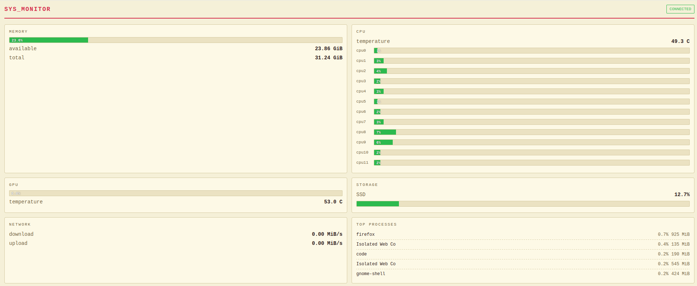

# retro-system-monitor-rpi5

A C++ system monitor targeting Linux, developed with the Raspberry Pi 5 in mind. The binary collects live system stats and pushes them over WebSocket to a Flask broker, which fans the data out to any browser connected to the dashboard. Designed so you can connect your phone to the Pi's WiFi and view its state in real time, alongside other components in the [Yocto streaming distro](https://github.com/Gilgameshgb-1/yocto-retro-streaming-distro).



## Project layout

```
.
├── include/                    abstract interface + Linux concrete header
│   ├── SystemMonitor.hpp
│   └── LinuxSystemMonitor.hpp
├── src/                        C++ producer (collector + WebSocket client)
│   ├── LinuxSystemMonitor.cpp
│   └── main.cpp
├── webserver/                  Flask broker + browser dashboard
│   ├── app.py
│   ├── templates/dashboard.html
│   └── requirements.txt
└── CMakeLists.txt
```

## How it fits together

```
[C++ binary]  --ws-->  [Flask broker]  --ws-->  [Browser]
 (producer)            (cache + fanout)        (consumer)
```

1. The C++ binary reads stats from the kernel once per second
2. It serialises them to JSON and sends to `ws://<host>:5000/ws/producer`
3. Flask caches the latest snapshot and broadcasts it to every connected dashboard at `ws://<host>:5000/ws/dashboard`
4. The browser dashboard renders the data with auto-reconnect, gracefully hiding cards when fields are missing

Because the broker is content-agnostic, any process that can speak WebSocket and produce the agreed JSON shape can act as the producer. The same Flask server runs unchanged on a Linux dev box, a Raspberry Pi, or anywhere else.

## What it monitors

All data is read directly from Linux kernel virtual filesystems (`/proc`, `/sys`) with no external dependencies on the producer side.

| Metric | Source | Notes |
|---|---|---|
| Available RAM | `/proc/meminfo` | `MemAvailable`, GiB |
| Total RAM | `/proc/meminfo` | `MemTotal`, GiB |
| CPU usage per core | `/proc/stat` | percent per core, snapshot diff |
| CPU temperature | `/sys/class/hwmon` | AMD: Tccd1 sensor |
| GPU usage | `/sys/class/drm` | AMD only |
| GPU temperature | `/sys/class/hwmon` | AMD only |
| Storage usage | `statvfs` | percent used, SSD or SD card |
| Network usage | `/proc/net/dev` | MiB/s up/down, sums all non-loopback interfaces |
| Top processes | `/proc/[pid]/stat`, `/proc/[pid]/status` | top 5 by CPU, with memory (MiB), snapshot diff |

Snapshot-based metrics (CPU usage, network, top processes) seed their initial state in the constructor and diff on each call. The producer loop sleeps 1 second between iterations, so the first send already contains meaningful percentages.

## Architecture (C++ side)

```
SystemMonitor          (abstract interface - include/SystemMonitor.hpp)
└── LinuxSystemMonitor (Linux implementation - src/LinuxSystemMonitor.cpp)
```

`SystemMonitor` defines the interface and a shared `ProcessInfo` struct. Platform-specific classes implement it - `LinuxSystemMonitor` for the development machine, with a `RPiSystemMonitor` planned for the Pi 5 where sensor paths and storage layout differ.

## Build the C++ producer

```bash
cmake -B build -S .
cmake --build build
./build/retro-system-monitor
```

The first build is slow because CMake fetches and compiles the dependencies via `FetchContent`:

| Library | Purpose |
|---|---|
| [IXWebSocket](https://github.com/machinezone/IXWebSocket) | WebSocket client with auto-reconnect |
| [nlohmann/json](https://github.com/nlohmann/json) | JSON serialisation |

Subsequent builds are fast (the deps are cached under `build/_deps/`).

## Run the Flask broker

```bash
cd webserver
python3 -m venv .venv
source .venv/bin/activate
pip install -r requirements.txt
python app.py
```

The server binds to `0.0.0.0:5000` so a phone on the same WiFi can reach it at `http://<host-ip>:5000`. See `webserver/README.md` for the JSON contract and a Python one-liner to simulate the producer without running the C++ binary.

## Requirements

- Linux
- CMake 3.16+
- C++17 compiler
- Python 3.10+ (for the broker)

## Hardware notes

Sensor paths are currently hardcoded for the development machine (AMD CPU + AMD GPU). These will differ on the RPi5 and will be handled by a dedicated `RPiSystemMonitor` class once the project moves to the Pi.

| Sensor | Path |
|---|---|
| CPU temp (AMD Tccd1) | `/sys/class/hwmon/hwmon2/temp3_input` |
| GPU temp (AMD) | `/sys/class/hwmon/hwmon4/temp1_input` |
| GPU usage (AMD) | `/sys/class/drm/card1/device/gpu_busy_percent` |
| RPi5 SoC temp | `/sys/class/thermal/thermal_zone0/temp` |

The RPi5 exposes a single thermal zone shared between the CPU and the VideoCore GPU, so on the Pi `getCPUTemperature` and `getGPUTemperature` will read from the same source.

## Status

| Component | Status |
|---|---|
| `SystemMonitor` abstract interface | done |
| `LinuxSystemMonitor` (dev machine) | done |
| C++ WebSocket producer | done |
| Flask broker + dashboard | done |
| `RPiSystemMonitor` (Pi 5) | pending |
| Yocto integration | pending |
